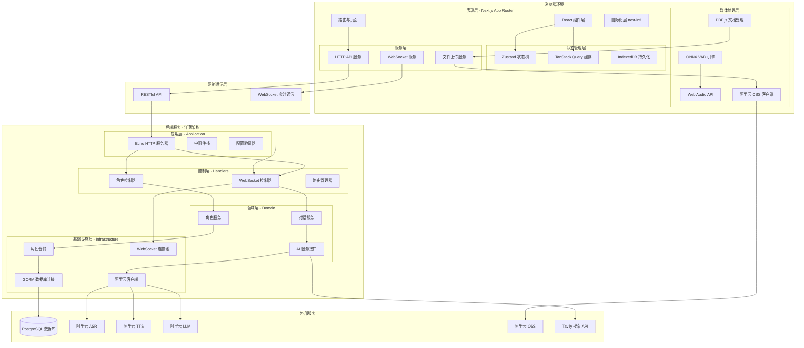
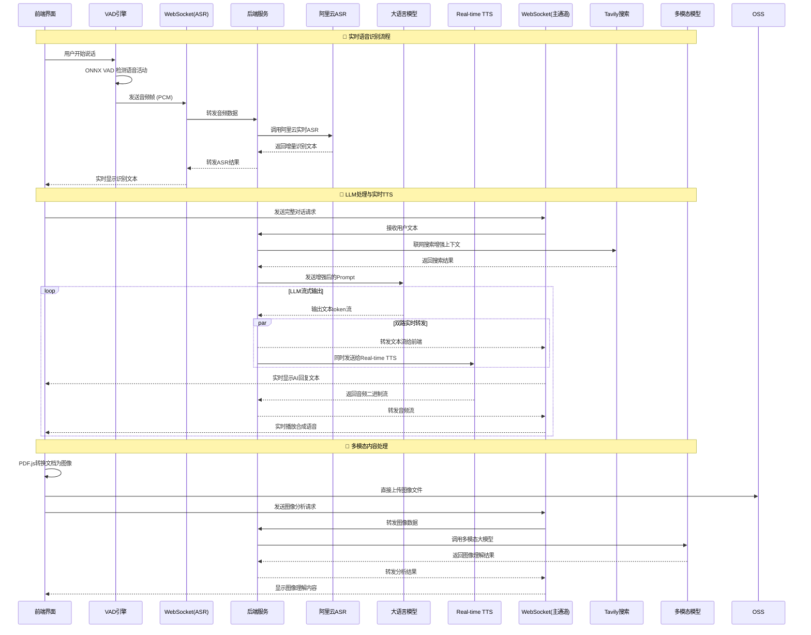

[![zread](https://img.shields.io/badge/Ask_Zread-_.svg?style=flat-square&color=00b0aa&labelColor=000000&logo=data%3Aimage%2Fsvg%2Bxml%3Bbase64%2CPHN2ZyB3aWR0aD0iMTYiIGhlaWdodD0iMTYiIHZpZXdCb3g9IjAgMCAxNiAxNiIgZmlsbD0ibm9uZSIgeG1sbnM9Imh0dHA6Ly93d3cudzMub3JnLzIwMDAvc3ZnIj4KPHBhdGggZD0iTTQuOTYxNTYgMS42MDAxSDIuMjQxNTZDMS44ODgxIDEuNjAwMSAxLjYwMTU2IDEuODg2NjQgMS42MDE1NiAyLjI0MDFWNC45NjAxQzEuNjAxNTYgNS4zMTM1NiAxLjg4ODEgNS42MDAxIDIuMjQxNTYgNS42MDAxSDQuOTYxNTZDNS4zMTUwMiA1LjYwMDEgNS42MDE1NiA1LjMxMzU2IDUuNjAxNTYgNC45NjAxVjIuMjQwMUM1LjYwMTU2IDEuODg2NjQgNS4zMTUwMiAxLjYwMDEgNC45NjE1NiAxLjYwMDFaIiBmaWxsPSIjZmZmIi8%2BCjxwYXRoIGQ9Ik00Ljk2MTU2IDEwLjM5OTlIMi4yNDE1NkMxLjg4ODEgMTAuMzk5OSAxLjYwMTU2IDEwLjY4NjQgMS42MDE1NiAxMS4wMzk5VjEzLjc1OTlDMS42MDE1NiAxNC4xMTM0IDEuODg4MSAxNC4zOTk5IDIuMjQxNTYgMTQuMzk5OUg0Ljk2MTU2QzUuMzE1MDIgMTQuMzk5OSA1LjYwMTU2IDE0LjExMzQgNS42MDE1NiAxMy43NTk5VjExLjAzOTlDNS42MDE1NiAxMC42ODY0IDUuMzE1MDIgMTAuMzk5OSA0Ljk2MTU2IDEwLjM5OTlaIiBmaWxsPSIjZmZmIi8%2BCjxwYXRoIGQ9Ik0xMy43NTg0IDEuNjAwMUgxMS4wMzg0QzEwLjY4NSAxLjYwMDEgMTAuMzk4NCAxLjg4NjY0IDEwLjM5ODQgMi4yNDAxVjQuOTYwMUMxMC4zOTg0IDUuMzEzNTYgMTAuNjg1IDUuNjAwMSAxMS4wMzg0IDUuNjAwMUgxMy43NTg0QzE0LjExMTkgNS42MDAxIDE0LjM5ODQgNS4zMTM1NiAxNC4zOTg0IDQuOTYwMVYyLjI0MDFDMTQuMzk4NCAxLjg4NjY0IDE0LjExMTkgMS42MDAxIDEzLjc1ODQgMS42MDAxWiIgZmlsbD0iI2ZmZiIvPgo8cGF0aCBkPSJNNCAxMkwxMiA0TDQgMTJaIiBmaWxsPSIjZmZmIi8%2BCjxwYXRoIGQ9Ik00IDEyTDEyIDQiIHN0cm9rZT0iI2ZmZiIgc3Ryb2tlLXdpZHRoPSIxLjUiIHN0cm9rZS1saW5lY2FwPSJyb3VuZCIvPgo8L3N2Zz4K&logoColor=ffffff)](https://zread.ai/CORCTON/EchoMe)


# EchoMe - 智能语音AI助手

## 🎬 演示视频

**[📺 观看完整演示视频](https://www.bilibili.com/video/BV1UEndzgEoQ/?vd_source=7e1f5ea5ff766d3e31b7bedb3cf5f6fe)**

体验 EchoMe 的实时语音交互、多模态内容理解和智能角色对话功能。

---

## 👥 团队分工

- **@CORCTON (CRT)** - 整体业务架构设计、前端开发
- **@Rson9 (LJX)** - 后端架构开发、Demo视频录制

---

## 🎯 产品定位与用户故事

### 目标用户群体

**1. 跨语言沟通需求用户**
- **核心能力匹配**: 实时翻译 + VAD语音检测 + 实时翻译官角色
- **痛点**: 需要进行多语言实时沟通，传统翻译工具延迟高、准确性差
- **用户故事**: "作为一名国际商务人员，我希望能够与外国客户进行流畅的语音对话，实时翻译官角色帮我准确传达商务意图，VAD技术确保对话自然流畅"

**2. 求职面试准备用户**
- **核心能力匹配**: 角色扮演 + 联网搜索 + 图像识别 + 模拟面试角色
- **痛点**: 缺乏真实面试练习机会，无法获得及时反馈和最新行业信息
- **用户故事**: "作为一名求职者，我希望通过模拟面试角色进行真实的语音面试练习，AI能联网获取最新行业动态，分析我上传的简历文档，给出针对性建议"

**3. 学习研究用户**
- **核心能力匹配**: 图像识别 + 联网搜索 + 苏格拉底/助理研究员角色
- **痛点**: 需要深度理解复杂学术材料，缺乏启发式学习指导
- **用户故事**: "作为一名研究生，我希望苏格拉底角色通过启发式提问帮我深度思考，助理研究员角色帮我分析PDF论文图表，联网搜索最新研究进展"

**4. 娱乐互动用户**
- **核心能力匹配**: 角色扮演 + 实时语音交互 + 哈利波特等娱乐角色
- **痛点**: 缺乏沉浸式娱乐体验，传统聊天机器人缺乏个性
- **用户故事**: "作为一名哈利波特粉丝，我希望能够与哈利波特角色进行真实的语音对话，体验魔法世界的沉浸式交互"

**5. 日常办公助手用户**
- **核心能力匹配**: 联网搜索 + 图像识别 + VAD语音检测 + 通用助手角色
- **痛点**: 需要高效处理多种办公任务，传统工具切换成本高
- **用户故事**: "作为一名办公人员，我希望通用助手角色能够帮我处理文档分析、信息查询、会议记录等多种任务，通过语音交互提高工作效率"

### 核心功能优先级

**P0 (核心功能)**
- 实时语音对话 - 基础交互能力
- 多模态内容理解 - 文档/图像分析
- 联网搜索增强 - 实时信息获取

**P1 (重要功能)**
- 多角色语音系统 - 个性化体验
- VAD实时语音检测 - 交互体验优化
- 实时翻译 - 多语言支持

**P2 (增强功能)**
- 图像识别 - 扩展理解能力
- 角色定制 - 个性化定制

### 本次开发功能

本次重点开发 **P0 和 P1 级别功能**，构建完整的语音AI交互体验，为用户提供智能、高效的多模态对话助手。

### LLM 模型选择

**选择**: 阿里云通义千问系列模型

**对比分析**:
- **OpenAI GPT-4**: 能力强但成本高，API稳定性在国内存在问题
- **百度文心一言**: 中文优化好，但多模态能力相对较弱
- **阿里云通义千问**: 性价比高，多模态能力强，国内访问稳定

**选择理由**:
1. **成本效益**: 相比GPT-4价格更优，适合高频语音交互场景
2. **多模态能力**: 原生支持图像理解，满足文档分析需求
3. **服务稳定性**: 国内部署，网络延迟低，服务可靠性高
4. **生态整合**: 与阿里云ASR/TTS服务深度整合，技术栈统一

### AI角色扩展技能

除语音聊天外，AI角色还具备：

- **📚 知识管理**: 文档解析、信息提取、知识图谱构建
- **🔍 实时搜索**: 联网获取最新信息，保持知识时效性
- **🌐 多语言处理**: 实时翻译、跨语言理解与交流
- **📊 数据分析**: 图表识别、数据解读、趋势分析
- **🎨 创意协作**: 内容创作、头脑风暴、创意激发
- **📝 文档处理**: PDF解析、内容总结、要点提取
- **🤖 个性化定制**: 根据用户偏好调整交互风格和专业领域

---

## 🚀 核心功能

### 🎙️ 实时语音交互
- **VAD实时语音检测**: ONNX模型精确检测语音活动边界
- **流式ASR识别**: 独立WebSocket通道处理实时语音转文字
- **Real-time TTS合成**: 高质量语音合成，支持角色语音克隆
- **双向流式通信**: 音频和文本双向实时传输

### 🌐 联网搜索增强
- **Tavily API集成**: 实时获取网络最新信息
- **上下文自动融合**: 搜索结果智能整合到对话中
- **知识实时更新**: 为AI角色提供最新信息获取能力

### 📄 多模态内容理解
- **PDF智能解析**: PDF.js引擎转换文档为高清图像
- **图像识别分析**: 多模态大模型理解图像内容
- **文档结构提取**: 自动识别文字、图表、表格等元素
- **知识整合**: 提取内容融入对话上下文

### 🌍 实时翻译
- **多语言语音识别**: 支持中英文等多种语言输入
- **智能语言检测**: 自动识别输入语言并切换
- **实时翻译输出**: 支持多语言文本和语音输出

### 🎭 多角色语音系统
- **角色个性定制**: 可配置多个AI角色，各具特色
- **语音克隆技术**: 阿里云TTS实现角色专属语音
- **角色轮播选择**: 直观的角色选择和切换界面
- **独立对话历史**: 每个角色维护独立的对话记录

---

## 🏗️ 系统架构设计

### 分层架构概览


#### 核心技术特性
- **WebSocket双通道**: ASR识别和主要数据传输分离处理
- **实时流处理**: LLM文本流和TTS音频流的并行处理架构
- **前端多媒体**: PDF.js转换、OSS直传、Web Audio音频处理
- **多模态AI**: 集成图像识别、联网搜索、实时语音合成
- **流式响应**: 所有AI服务都采用流式处理，最小化延迟

### 核心数据流与通信模式

#### 实时语音对话架构


#### 系统核心处理流程

```mermaid
flowchart TD
    subgraph "前端核心处理"
        A1[VAD 语音活动检测] --> A2[音频帧采集]
        A2 --> A3[WebSocket ASR通道]
        
        B1[PDF.js 文档处理] --> B2[页面转图像]
        B2 --> B3[直接上传 OSS]
        
        C1[音频流接收] --> C2[Web Audio API]
        C2 --> C3[实时音频播放]
    end
    
    subgraph "后端核心处理"
        D1[WebSocket 连接管理] --> D2[音频数据转发]
        D2 --> D3[阿里云 ASR]
        
        E1[文本接收] --> E2[Tavily 联网搜索]
        E2 --> E3[上下文增强]
        E3 --> E4[LLM 处理]
        
        F1[LLM 流式输出] --> F2[双路实时转发]
        F2 --> F3[前端文本流]
        F2 --> F4[Real-time TTS]
        F4 --> F5[音频流转发]
        
        G1[图像数据] --> G2[多模态大模型]
        G2 --> G3[图像理解结果]
    end
    
    subgraph "外部AI服务"
        ASR_SVC[阿里云 ASR]
        TTS_SVC[Real-time TTS]
        LLM_SVC[大语言模型]
        MM_SVC[多模态模型]
        TAV_SVC[Tavily API]
        OSS_SVC[阿里云 OSS]
    end
    
    A3 --> D1
    D3 --> ASR_SVC
    B3 --> OSS_SVC
    E4 --> LLM_SVC
    F4 --> TTS_SVC
    G2 --> MM_SVC
    E2 --> TAV_SVC
    
    F3 --> C1
    F5 --> C1
```


### 业务流程说明

#### AI角色生命周期
1. **角色创建**: 用户定义角色基本信息和个性特征
2. **属性配置**: 设置系统提示词、行为模式、专业领域
3. **语音训练**: 上传示例音频，训练专属语音模型  
4. **角色部署**: 角色就绪，可参与对话交互
5. **持续优化**: 根据对话反馈调整角色表现

#### 实时对话处理流程
1. **语音检测**: 前端VAD引擎实时检测语音活动边界
2. **实时转录**: 独立WebSocket通道进行流式ASR识别
3. **联网增强**: 后端使用Tavily API获取最新信息
4. **LLM处理**: 大语言模型基于角色人设生成回复
5. **双路转发**: LLM输出流同时转发给前端和Real-time TTS
6. **实时合成**: Real-time TTS生成高质量音频流
7. **音频播放**: 前端Web Audio API处理音频播放逻辑

#### 多模态内容处理流程
1. **文档预处理**: 前端PDF.js将PDF文档转换为高清图像
2. **直接上传**: 图像文件直接上传到阿里云OSS存储
3. **多模态理解**: 后端调用多模态大模型进行图像识别分析
4. **内容提取**: 自动识别文档结构、文字、图表等关键信息
5. **知识整合**: 提取的内容融入对话上下文和角色知识体系

## 🛠️ 技术栈

### 前端 (echome-fe)
- **Next.js 15.5.3**: App Router + React 19
- **TypeScript 5**: 完整类型安全
- **Tailwind CSS + shadcn/ui**: 现代UI组件系统
- **Zustand + TanStack Query**: 状态管理与数据缓存
- **Web Audio API**: 音频处理与播放
- **PDF.js 4.4.168**: PDF文档解析
- **ONNX Runtime**: VAD语音检测模型

### 后端 (echome-be)
- **Go 1.24.3**: 高性能后端服务
- **Echo v4**: Web框架与WebSocket支持
- **PostgreSQL + GORM**: 数据持久化
- **Google Wire**: 依赖注入
- **阿里云AI服务**: ASR/TTS/LLM集成

### 基础设施
- **Docker + Docker Compose**: 容器化部署
- **GitHub Actions**: CI/CD自动化
- **阿里云OSS**: 对象存储服务

---

## 🚀 快速开始

### 环境要求
- Node.js 20+
- Go 1.24+
- PostgreSQL 15+
- pnpm 9+

### 前端开发
```bash
cd echome-fe/
pnpm install
pnpm dev
```

### 后端开发
```bash
cd echome-be/

# 配置环境
cp config/etc/config.yaml.example config/etc/config.yaml
# 编辑 config.yaml 填入配置信息

# 数据库迁移
go run tools/migrate.go

# 启动服务
go run cmd/main/main.go
```

---

## 🐳 Docker 部署

```bash
git clone https://github.com/CORCTON/EchoMe.git
cd EchoMe/deploy
docker-compose up -d
```

---

## 📁 项目结构

```
EchoMe/
├── echome-fe/                    # Next.js 前端应用
│   ├── app/                      # App Router 页面
│   ├── components/               # React 组件
│   ├── store/                    # Zustand 状态管理
│   └── services/                 # API 服务
├── echome-be/                    # Go 后端服务
│   ├── internal/
│   │   ├── domain/               # 领域层
│   │   ├── handler/              # 控制器层
│   │   └── infra/                # 基础设施层
│   └── config/                   # 配置管理
└── deploy/                       # 部署配置
```

---

## ⚙️ 配置说明

### 前端环境变量
```bash
# 阿里云 OSS 配置
OSS_BUCKET=your-bucket-name
OSS_REGION=oss-cn-hangzhou
OSS_ACCESS_KEY_ID=your-access-key
OSS_ACCESS_KEY_SECRET=your-secret-key
```

### 后端配置文件
```yaml
server:
  port: "8080"

ai:
  service_type: "aliyun"
  timeout: 30

aliyun:
  region: "cn-hangzhou"
  access_key_id: "your-access-key"
  access_key_secret: "your-secret-key"
  app_key: "your-app-key"

database:
  host: "localhost"
  port: 5432
  user: "postgres"
  password: "your-password"
  dbname: "echome"
```

---

## 🤝 贡献指南

1. Fork 项目
2. 创建特性分支: `git checkout -b feat/new-feature`
3. 提交更改: `git commit -m 'feat: add new feature'`
4. 推送分支: `git push origin feat/new-feature`
5. 创建 Pull Request

---

## 📜 许可证

本项目采用 MIT 许可证 - 查看 [LICENSE](LICENSE) 文件了解详情
