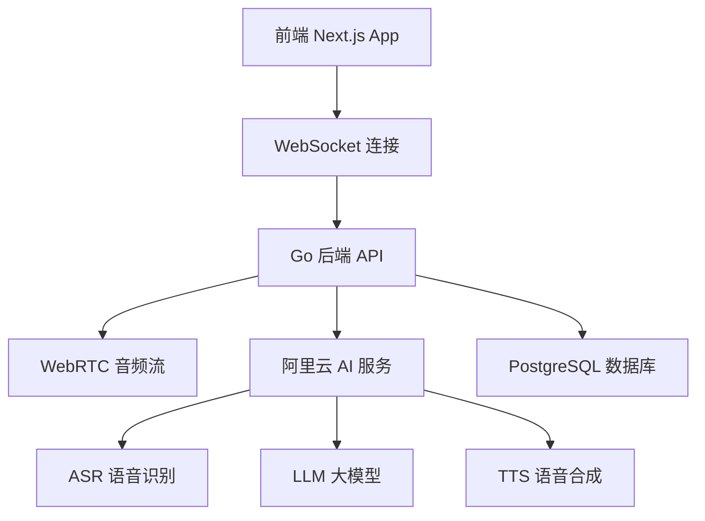

<!-- Demo 视频位置 - 在此处添加演示视频 -->
*Demo 视频即将上线，敬请期待 🎬*

# EchoMe

基于 WebRTC 的实时语音 AI 助手，支持多种 AI 服务提供商和语音处理功能。

## 🏗️ 架构设计



## 🛠️ 技术栈

### 前端 (echome-fe)

#### 核心框架
- **Next.js 15.5.3**: App Router + Server Components + Standalone 输出
- **React 19.1.0**: 最新 React 版本，支持并发特性
- **TypeScript 5**: 静态类型检查，提供完整类型定义

#### UI 组件系统
- **Tailwind CSS 4**: 原子化 CSS 框架，PostCSS 集成
- **shadcn/ui**: 基于 Radix UI 的现代组件库
  - Alert Dialog、Avatar、Collapsible、Dialog、Switch、Tooltip 等
- **Radix UI Primitives**: 无样式、可访问的 UI 原语
- **Class Variance Authority (CVA)**: 组件变体管理
- **Framer Motion**: 高性能动画库 (motion v12.23.22)

#### 音频处理技术栈
- **@ricky0123/vad-web**: WebAssembly 语音活动检测 (VAD)
- **ONNX Runtime Web**: 机器学习模型推理 (VAD 模型)
- **Opus Media Recorder**: 高质量音频编码录制
- **PCM Player**: 原始音频播放控制
- **Web Audio API**: 底层音频处理和增益控制

#### 状态管理与数据
- **Zustand 5.0.8**: 轻量级状态管理，支持持久化
- **TanStack Query 5.90.2**: 服务端状态缓存和同步
- **WebSocket**: 实时音频流和消息通信
- **IndexedDB**: 本地数据持久化存储

#### 媒体与内容
- **React Markdown**: Markdown 渲染 + GFM 扩展支持
- **Shiki 3.13.0**: 代码语法高亮
- **Rive App**: 交互式矢量动画播放
- **Ali OSS**: 阿里云对象存储集成

#### 开发工具链
- **Biome**: 快速 Linter + Formatter (替代 ESLint + Prettier)
- **Copy Webpack Plugin**: 静态资源复制 (WASM/ONNX 模型)
- **next-intl**: 国际化路由和翻译管理

#### 辅助库
- **Jose**: JWT 令牌处理
- **UUID**: 唯一标识符生成
- **Lucide React**: 现代图标库
- **CLSX + Tailwind Merge**: 条件类名处理

### 后端 (echome-be)
- **语言**: Go 1.24.3
- **框架**: Echo v4 + WebSocket (Gorilla)
- **数据库**: PostgreSQL + GORM v2
- **配置**: Koanf (YAML)
- **依赖注入**: Google Wire
- **日志**: Zap
- **文档**: Swagger (swaggo)
- **AI 服务**: 阿里云语音 AI (ASR/TTS/LLM)

### 基础设施
- **容器化**: Docker + Docker Compose
- **对象存储**: 阿里云 OSS
- **CI/CD**: GitHub Actions
- **部署**: Linux 服务器 + PM2

## � 项目结构

```
EchoMe/
├── echome-fe/                    # Next.js 前端应用
│   ├── app/                      # App Router 页面
│   ├── components/               # React 组件
│   │   ├── ui/                   # shadcn/ui 组件
│   │   └── *.tsx                 # 业务组件
│   ├── hooks/                    # 自定义 Hooks
│   ├── lib/                      # 工具函数
│   ├── messages/                 # 国际化文件
│   ├── services/                 # API 服务
│   ├── store/                    # Zustand 状态管理
│   └── types/                    # TypeScript 类型定义
├── echome-be/                    # Go 后端服务
│   ├── cmd/main/                 # 应用入口
│   ├── config/                   # 配置管理
│   ├── internal/
│   │   ├── app/                  # 应用层
│   │   ├── domain/               # 领域层
│   │   ├── handler/              # 控制器层
│   │   └── infra/                # 基础设施层
│   ├── gen/                      # GORM 生成代码
│   └── docs/                     # Swagger 文档
└── deploy/                       # 部署脚本和配置
```

## 🚀 快速开始

### 环境要求
- Node.js 20+
- Go 1.24+  
- PostgreSQL 15+
- pnpm 9+

### 前端开发
```bash
cd echome-fe/
pnpm install
pnpm dev
```

前端将在 http://localhost:3000 启动

### 后端开发
```bash
cd echome-be/

# 安装依赖
go mod download

# 配置数据库和 AI 服务
cp config/etc/config.yaml.example config/etc/config.yaml
# 编辑 config.yaml，填入数据库和阿里云配置

# 运行数据库迁移
go run tools/migrate.go

# 启动开发服务器
go run cmd/main/main.go
```

后端将在 http://localhost:8080 启动

## ⚙️ 配置说明

### 环境变量配置

#### 前端环境变量 (.env.local)
```bash
# 阿里云 OSS 配置
OSS_BUCKET=your-bucket-name
OSS_REGION=oss-cn-hangzhou
OSS_ACCESS_KEY_ID=your-access-key
OSS_ACCESS_KEY_SECRET=your-secret-key

# NextAuth 配置
NEXTAUTH_URL=http://localhost:3000
NEXTAUTH_SECRET=your-nextauth-secret
```

#### 后端配置文件 (config/etc/config.yaml)
```yaml
server:
  port: "8080"

webrtc:
  stun_server: "stun:stun.l.google.com:19302"

ai:
  service_type: "aliyun"
  timeout: 30
  max_retries: 3

aliyun:
  region: "cn-hangzhou" 
  access_key_id: "your-access-key"
  access_key_secret: "your-secret-key"
  app_key: "your-app-key"

database:
  host: "localhost"
  port: 5432
  user: "postgres"
  password: "your-password"
  dbname: "echome"
  ssl_mode: "disable"
```

## � Docker 部署

### 使用 Docker Compose
```bash
# 克隆项目
git clone https://github.com/your-username/EchoMe.git
cd EchoMe

# 启动服务
cd deploy
docker-compose up -d
```

### 手动构建镜像
```bash
# 构建前端镜像
cd echome-fe
docker build -t echome-fe .

# 构建后端镜像  
cd ../echome-be
docker build -t echome-be .
```

## 🔄 CI/CD 部署

项目支持 GitHub Actions 自动化部署：

### 部署配置
1. 在 GitHub 仓库设置中配置 Secrets：
   - `SERVER_HOST`: 服务器地址
   - `SERVER_USER`: SSH 用户名  
   - `SERVER_PASSWORD`: SSH 密码
   - `SERVER_PORT`: SSH 端口 (默认 22)

2. 推送到 main 分支自动触发部署
3. 支持手动触发部署：Actions → Deploy Frontend/Backend → Run workflow

### 部署目录结构
```
/opt/
├── echome-fe/
│   ├── current/          # 当前版本软链接
│   └── releases/         # 历史版本
└── echome-be/
    ├── current/          # 当前版本软链接  
    └── releases/         # 历史版本
```

## 🧪 开发工具

### 代码质量
```bash
# 前端代码检查和格式化
cd echome-fe
pnpm lint
pnpm format

# 后端代码格式化
cd echome-be  
go fmt ./...
go vet ./...
```

### API 文档
后端集成了 Swagger 文档，启动后访问：
- Swagger UI: http://localhost:8080/swagger/index.html
- OpenAPI JSON: http://localhost:8080/swagger/doc.json

### 数据库迁移
```bash
cd echome-be
go run tools/migrate.go
```

## 🎯 核心功能

### 语音处理流程
1. **音频采集**: 
   - MediaDevices API 获取麦克风权限
   - Web Audio API 音频上下文和增益控制
   - Opus Media Recorder 高质量编码

2. **语音活动检测 (VAD)**:
   - ONNX Runtime 加载 WebAssembly VAD 模型
   - 实时检测语音开始/结束
   - 预缓冲机制避免语音开头丢失

3. **语音识别 (ASR)**:
   - WebSocket 连接阿里云实时 ASR 服务
   - PCM 音频帧流式传输
   - 增量识别结果和最终确认

4. **语言理解与回复**:
   - Zustand 状态管理会话历史
   - WebSocket 双向通信传输对话
   - 大模型生成智能回复

5. **语音合成与播放**:
   - 阿里云 TTS 生成高质量音频
   - PCM Player 控制音频播放
   - AudioBuffer 队列管理连续播放

### 支持的 AI 服务
- **ASR**: 阿里云实时语音识别
- **LLM**: 支持多种大模型接口
- **TTS**: 阿里云语音合成 (支持角色克隆)
- **搜索**: Tavily AI 搜索增强

### 主要特性

#### 🎤 实时语音交互
- **低延迟音频处理**: Web Audio API + WebSocket 优化
- **智能语音检测**: ONNX VAD 模型精确识别语音边界
- **流式语音识别**: 增量 ASR 结果，实时文本反馈
- **音频预缓冲**: 防止语音开头丢失的缓冲机制

#### 🎨 现代 UI/UX
- **响应式设计**: 移动端优先，完美适配各种设备
- **Dark/Light 主题**: 系统主题自动切换
- **动画交互**: Framer Motion 流畅动画效果
- **可访问性**: 完整的键盘导航和屏幕阅读器支持

#### 🗣️ 多角色语音
- **角色管理系统**: 可配置多个 AI 角色
- **语音克隆**: 阿里云 TTS 角色语音合成
- **角色轮播**: 直观的角色选择界面
- **个性化设置**: 每个角色独立的对话历史

#### 🌐 国际化支持
- **多语言界面**: 中英文界面完整翻译
- **语音识别多语言**: 支持中英文语音输入
- **自动语言检测**: 根据用户输入智能切换
- **本地化配置**: 时区、数字格式等本地化

#### � 技术特性
- **PWA 就绪**: 支持离线使用和桌面安装
- **状态持久化**: 会话和设置自动保存
- **错误边界**: 完善的错误处理和用户反馈
- **性能优化**: 代码分割、懒加载、缓存策略

## 🤝 贡献指南

1. Fork 项目
2. 创建特性分支: `git checkout -b feat/new-feature`
3. 提交更改: `git commit -m 'feat: add new feature'`
4. 推送分支: `git push origin feat/new-feature`
5. 创建 Pull Request

## � 许可证

本项目采用 MIT 许可证 - 查看 [LICENSE](LICENSE) 文件了解详情
