<!-- Demo 视频位置 - 在此处添加演示视频 -->
*Demo 视频即将上线，敬请期待 🎬*

# EchoMe

基于 WebRTC 的实时语音 AI 助手，支持多种 AI 服务提供商和语音处理功能。

## 目录

- [EchoMe](#echome)
  - [目录](#目录)
  - [🚀 快速开始](#快速开始)
    - [环境要求](#环境要求)
    - [前端开发](#前端开发)
    - [后端开发](#后端开发)
  - [🎯 核心功能](#核心功能)
    - [实时语音交互](#实时语音交互)
    - [多角色语音系统](#多角色语音系统)
    - [多模态内容理解](#多模态内容理解)
    - [联网搜索增强](#联网搜索增强)
    - [现代 UI/UX](#现代-uiux)
    - [国际化支持](#国际化支持)
  - [🛠️ 技术栈](#技术栈)
    - [前端 (echome-fe)](#前端-echome-fe)
    - [后端 (echome-be)](#后端-echome-be)
    - [基础设施](#基础设施)
  - [🏗️ 系统架构设计](#系统架构设计)
    - [分层架构概览](#分层架构概览)
    - [核心数据流与通信模式](#核心数据流与通信模式)
    - [业务流程说明](#业务流程说明)
  - [📁 项目结构](#项目结构)
  - [⚙️ 配置说明](#配置说明)
    - [前端环境变量](#前端环境变量)
    - [后端配置文件](#后端配置文件)
  - [🐳 Docker 部署](#docker-部署)
  - [🔄 CI/CD 部署](#cicd-部署)
  - [🧪 开发工具](#开发工具)
  - [🤝 贡献指南](#贡献指南)
  - [📜 许可证](#许可证)  

## 快速开始

### 环境要求
- Node.js 20+
- Go 1.24+  
- PostgreSQL 15+
- pnpm 9+

### 前端开发
```bash
cd echome-fe/
pnpm install
pnpm dev
```

前端将在 http://localhost:3000 启动

### 后端开发
```bash
cd echome-be/

# 安装依赖
go mod download

# 配置数据库和 AI 服务
cp config/etc/config.yaml.example config/etc/config.yaml
# 编辑 config.yaml，填入数据库和阿里云配置

# 运行数据库迁移
go run tools/migrate.go

# 启动开发服务器
go run cmd/main/main.go
```

后端将在 http://localhost:8080 启动

## 核心功能

### 实时语音交互
- **前端VAD处理**: ONNX模型在浏览器端精确检测语音活动
- **独立ASR通道**: 专用WebSocket连接处理实时语音识别
- **双路流式架构**: LLM输出同时转发给前端显示和Real-time TTS
- **端到端音频**: 前端负责音频采集、播放和核心音频逻辑处理
- **双向流式通信**: WebSocket保持长连接，支持音频和文本双向流传输
- **增量数据处理**: 语音识别和合成都采用流式处理，减少延迟
- **错误恢复机制**: 连接中断自动重连，音频缓冲防止数据丢失

### 多角色语音系统
- **角色管理系统**: 可配置多个 AI 角色
- **语音克隆**: 阿里云 TTS 角色语音合成
- **角色轮播**: 直观的角色选择界面
- **个性化设置**: 每个角色独立的对话历史
- **角色创建流程**: 从基础信息到语音训练的完整流程
- **系统提示词配置**: 定义角色个性和行为模式

### 多模态内容理解
- **文档预处理**: 前端PDF.js将PDF文档转换为高清图像
- **直接上传**: 图像文件直接上传到阿里云OSS存储
- **多模态理解**: 后端调用多模态大模型进行图像识别分析
- **内容提取**: 自动识别文档结构、文字、图表等关键信息
- **知识整合**: 提取的内容融入对话上下文和角色知识体系
- **PDF智能解析**: 使用PDF.js 4.4.168引擎处理文档

### 联网搜索增强
- **Tavily API集成**: 实时获取网络最新信息
- **上下文增强**: 搜索结果自动融入对话上下文
- **知识更新**: 为AI角色提供实时信息获取能力
- **搜索结果自动融入System Prompt**: 提升对话质量

### 现代 UI/UX
- **响应式设计**: 移动端优先，完美适配各种设备
- **Dark/Light 主题**: 系统主题自动切换
- **动画交互**: Framer Motion流畅动画效果
- **文件管理体验**: 拖拽上传、实时进度、预览和管理界面
- **可访问性**: 完整的键盘导航和屏幕阅读器支持

### 国际化支持
- **多语言界面**: 中英文界面完整翻译
- **语音识别多语言**: 支持中英文语音输入
- **自动语言检测**: 根据用户输入智能切换
- **本地化配置**: 时区、数字格式等本地化

## 技术栈

### 前端 (echome-fe)

#### 核心框架
- **Next.js 15.5.3**: App Router + Server Components + Standalone 输出
- **React 19.1.0**: 最新 React 版本，支持并发特性
- **TypeScript 5**: 静态类型检查，提供完整类型定义

#### UI 组件系统
- **Tailwind CSS 4**: 原子化 CSS 框架，PostCSS 集成
- **shadcn/ui**: 基于 Radix UI 的现代组件库
- **Radix UI Primitives**: 无样式、可访问的 UI 原语
- **Class Variance Authority (CVA)**: 组件变体管理
- **Framer Motion**: 高性能动画库 (motion v12.23.22)

#### 音频处理技术栈
- **@ricky0123/vad-web**: WebAssembly 语音活动检测 (VAD)
- **ONNX Runtime Web**: 机器学习模型推理 (VAD 模型)
- **Opus Media Recorder**: 高质量音频编码录制
- **PCM Player**: 原始音频播放控制
- **Web Audio API**: 底层音频处理和增益控制

#### 状态管理与数据
- **Zustand 5.0.8**: 轻量级状态管理，支持持久化
- **TanStack Query 5.90.2**: 服务端状态缓存和同步
- **WebSocket**: 实时音频流和消息通信
- **IndexedDB**: 本地数据持久化存储

#### 媒体与内容处理
- **PDF.js 4.4.168**: PDF文档解析和页面转换
- **图像上传系统**: 拖拽上传、多文件批量上传、进度实时显示
- **阿里云 OSS 集成**: 直接上传到对象存储
- **内容渲染**: React Markdown + GFM 扩展支持

#### 开发工具链
- **Biome**: 快速 Linter + Formatter
- **Copy Webpack Plugin**: 静态资源复制
- **next-intl**: 国际化路由和翻译管理

### 后端 (echome-be)
- **语言**: Go 1.24.3
- **框架**: Echo v4 + WebSocket (Gorilla)
- **数据库**: PostgreSQL + GORM v2
- **配置**: Koanf (YAML)
- **依赖注入**: Google Wire
- **日志**: Zap
- **文档**: Swagger (swaggo)
- **AI 服务**: 阿里云语音 AI (ASR/TTS/LLM)

### 基础设施
- **容器化**: Docker + Docker Compose
- **对象存储**: 阿里云 OSS
- **CI/CD**: GitHub Actions
- **部署**: Linux 服务器 + PM2

## 系统架构设计

### 分层架构概览


#### 核心技术特性
- **WebSocket双通道**: ASR识别和主要数据传输分离处理
- **实时流处理**: LLM文本流和TTS音频流的并行处理架构
- **前端多媒体**: PDF.js转换、OSS直传、Web Audio音频处理
- **多模态AI**: 集成图像识别、联网搜索、实时语音合成
- **流式响应**: 所有AI服务都采用流式处理，最小化延迟

### 核心数据流与通信模式

#### 实时语音对话架构

```mermaid
sequenceDiagram
    participant U as 前端界面
    participant V as VAD引擎
    participant WS1 as WebSocket(ASR)
    participant BE as 后端服务
    participant ASR as 阿里云ASR
    participant LLM as 大语言模型
    participant TTS as Real-time TTS
    participant WS2 as WebSocket(主通道)
    participant TAV as Tavily搜索
    participant MM as 多模态模型
    
    Note over U,MM: 🎤 实时语音识别流程
    U->>V: 用户开始说话
    V->>V: ONNX VAD 检测语音活动
    V->>WS1: 发送音频帧 (PCM)
    WS1->>BE: 转发音频数据
    BE->>ASR: 调用阿里云实时ASR
    ASR-->>BE: 返回增量识别文本
    BE-->>WS1: 转发ASR结果
    WS1-->>U: 实时显示识别文本
    
    Note over U,MM: 🧠 LLM处理与实时TTS
    U->>WS2: 发送完整对话请求
    WS2->>BE: 接收用户文本
    BE->>TAV: 联网搜索增强上下文
    TAV-->>BE: 返回搜索结果
    BE->>LLM: 发送增强后的Prompt
    
    loop LLM流式输出
        LLM-->>BE: 输出文本token流
        par 双路实时转发
            BE-->>WS2: 转发文本流给前端
            BE->>TTS: 同时发送给Real-time TTS
        end
        WS2-->>U: 实时显示AI回复文本
        TTS-->>BE: 返回音频二进制流
        BE-->>WS2: 转发音频流
        WS2-->>U: 实时播放合成语音
    end
    
    Note over U,MM: 📄 多模态内容处理
    U->>U: PDF.js转换文档为图像
    U->>OSS: 直接上传图像文件
    U->>WS2: 发送图像分析请求
    WS2->>BE: 转发图像数据
    BE->>MM: 调用多模态大模型
    MM-->>BE: 返回图像理解结果
    BE-->>WS2: 转发分析结果
    WS2-->>U: 显示图像理解内容
```


#### 系统核心处理流程

```mermaid
flowchart TD
    subgraph "前端核心处理"
        A1[VAD 语音活动检测] --> A2[音频帧采集]
        A2 --> A3[WebSocket ASR通道]
        
        B1[PDF.js 文档处理] --> B2[页面转图像]
        B2 --> B3[直接上传 OSS]
        
        C1[音频流接收] --> C2[Web Audio API]
        C2 --> C3[实时音频播放]
    end
    
    subgraph "后端核心处理"
        D1[WebSocket 连接管理] --> D2[音频数据转发]
        D2 --> D3[阿里云 ASR]
        
        E1[文本接收] --> E2[Tavily 联网搜索]
        E2 --> E3[上下文增强]
        E3 --> E4[LLM 处理]
        
        F1[LLM 流式输出] --> F2[双路实时转发]
        F2 --> F3[前端文本流]
        F2 --> F4[Real-time TTS]
        F4 --> F5[音频流转发]
        
        G1[图像数据] --> G2[多模态大模型]
        G2 --> G3[图像理解结果]
    end
    
    subgraph "外部AI服务"
        ASR_SVC[阿里云 ASR]
        TTS_SVC[Real-time TTS]
        LLM_SVC[大语言模型]
        MM_SVC[多模态模型]
        TAV_SVC[Tavily API]
        OSS_SVC[阿里云 OSS]
    end
    
    A3 --> D1
    D3 --> ASR_SVC
    B3 --> OSS_SVC
    E4 --> LLM_SVC
    F4 --> TTS_SVC
    G2 --> MM_SVC
    E2 --> TAV_SVC
    
    F3 --> C1
    F5 --> C1
```


### 业务流程说明

#### AI角色生命周期
1. **角色创建**: 用户定义角色基本信息和个性特征
2. **属性配置**: 设置系统提示词、行为模式、专业领域
3. **语音训练**: 上传示例音频，训练专属语音模型  
4. **角色部署**: 角色就绪，可参与对话交互
5. **持续优化**: 根据对话反馈调整角色表现

#### 实时对话处理流程
1. **语音检测**: 前端VAD引擎实时检测语音活动边界
2. **实时转录**: 独立WebSocket通道进行流式ASR识别
3. **联网增强**: 后端使用Tavily API获取最新信息
4. **LLM处理**: 大语言模型基于角色人设生成回复
5. **双路转发**: LLM输出流同时转发给前端和Real-time TTS
6. **实时合成**: Real-time TTS生成高质量音频流
7. **音频播放**: 前端Web Audio API处理音频播放逻辑

#### 多模态内容处理流程
1. **文档预处理**: 前端PDF.js将PDF文档转换为高清图像
2. **直接上传**: 图像文件直接上传到阿里云OSS存储
3. **多模态理解**: 后端调用多模态大模型进行图像识别分析
4. **内容提取**: 自动识别文档结构、文字、图表等关键信息
5. **知识整合**: 提取的内容融入对话上下文和角色知识体系

## 项目结构

```
EchoMe/
├── echome-fe/                    # Next.js 前端应用
│   ├── app/                      # App Router 页面
│   ├── components/               # React 组件
│   │   ├── ui/                   # shadcn/ui 组件
│   │   └── *.tsx                 # 业务组件
│   ├── hooks/                    # 自定义 Hooks
│   ├── lib/                      # 工具函数
│   ├── messages/                 # 国际化文件
│   ├── services/                 # API 服务
│   ├── store/                    # Zustand 状态管理
│   └── types/                    # TypeScript 类型定义
├── echome-be/                    # Go 后端服务
│   ├── cmd/main/                 # 应用入口
│   ├── config/                   # 配置管理
│   ├── internal/
│   │   ├── app/                  # 应用层
│   │   ├── domain/               # 领域层
│   │   ├── handler/              # 控制器层
│   │   └── infra/                # 基础设施层
│   ├── gen/                      # GORM 生成代码
│   └── docs/                     # Swagger 文档
└── deploy/                       # 部署脚本和配置
```

## 配置说明

### 前端环境变量
```bash
# 阿里云 OSS 配置
OSS_BUCKET=your-bucket-name
OSS_REGION=oss-cn-hangzhou
OSS_ACCESS_KEY_ID=your-access-key
OSS_ACCESS_KEY_SECRET=your-secret-key

# NextAuth 配置
NEXTAUTH_URL=http://localhost:3000
NEXTAUTH_SECRET=your-nextauth-secret
```

### 后端配置文件
```yaml
server:
  port: "8080"

webrtc:
  stun_server: "stun:stun.l.google.com:19302"

ai:
  service_type: "aliyun"
  timeout: 30
  max_retries: 3

aliyun:
  region: "cn-hangzhou" 
  access_key_id: "your-access-key"
  access_key_secret: "your-secret-key"
  app_key: "your-app-key"

database:
  host: "localhost"
  port: 5432
  user: "postgres"
  password: "your-password"
  dbname: "echome"
  ssl_mode: "disable"
```

## Docker 部署

### 使用 Docker Compose
```bash
# 克隆项目
git clone https://github.com/your-username/EchoMe.git
cd EchoMe

# 启动服务
cd deploy
docker-compose up -d
```

### 手动构建镜像
```bash
# 构建前端镜像
cd echome-fe
docker build -t echome-fe .

# 构建后端镜像  
cd ../echome-be
docker build -t echome-be .
```

## CI/CD 部署

项目支持 GitHub Actions 自动化部署：

### 部署配置
1. 在 GitHub 仓库设置中配置 Secrets：
   - `SERVER_HOST`: 服务器地址
   - `SERVER_USER`: SSH 用户名  
   - `SERVER_PASSWORD`: SSH 密码
   - `SERVER_PORT`: SSH 端口 (默认 22)

2. 推送到 main 分支自动触发部署
3. 支持手动触发部署：Actions → Deploy Frontend/Backend → Run workflow

### 部署目录结构
```
/opt/
├── echome-fe/
│   ├── current/          # 当前版本软链接
│   └── releases/         # 历史版本
└── echome-be/
    ├── current/          # 当前版本软链接  
    └── releases/         # 历史版本
```

## 开发工具

### 代码质量
```bash
# 前端代码检查和格式化
cd echome-fe
pnpm lint
pnpm format

# 后端代码格式化
cd echome-be  
go fmt ./...
go vet ./...
```

### API 文档
后端集成了 Swagger 文档，启动后访问：
- Swagger UI: http://localhost:8080/swagger/index.html
- OpenAPI JSON: http://localhost:8080/swagger/doc.json

### 数据库迁移
```bash
cd echome-be
go run tools/migrate.go
```

## 贡献指南

1. Fork 项目
2. 创建特性分支: `git checkout -b feat/new-feature`
3. 提交更改: `git commit -m 'feat: add new feature'`
4. 推送分支: `git push origin feat/new-feature`
5. 创建 Pull Request

## 许可证

本项目采用 MIT 许可证 - 查看 [LICENSE](LICENSE) 文件了解详情