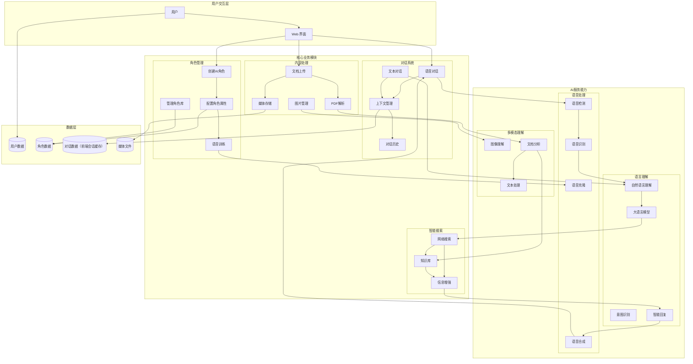

<!-- Demo 视频位置 - 在此处添加演示视频 -->
*Demo 视频即将上线，敬请期待 🎬*

# EchoMe

基于 WebRTC 的实时语音 AI 助手，支持多种 AI 服务提供商和语音处理功能。

## 🏗️ 系统架构设计

### 分层架构概览
```mermaid
graph TB
    subgraph "浏览器环境"
        subgraph "表现层 - Next.js App Router"
            UI[React 组件层]
            ROUTE[路由与页面]
            INTL[国际化层 next-intl]
        end
        
        subgraph "状态管理层"
            ZUSTAND[Zustand 状态树]
            QUERY[TanStack Query 缓存]
            PERSIST[IndexedDB 持久化]
        end
        
        subgraph "服务层"
            API_SERVICE[HTTP API 服务]
            WS_SERVICE[WebSocket 服务]
            UPLOAD[文件上传服务]
        end
     #### 🔧 核心技术特性
- **WebSocket双通道**: ASR识别和主要数据传输分离处理
- **实时流处理**: LLM文本流和TTS音频流的并行处理架构
- **前端多媒体**: PDF.js转换、OSS直传、Web Audio音频处理
- **多模态AI**: 集成图像识别、联网搜索、实时语音合成
- **流式响应**: 所有AI服务都采用流式处理，最小化延迟       subgraph "媒体处理层"
            VAD[ONNX VAD 引擎]
            PDFJS[PDF.js 文档处理]
            AUDIO[Web Audio API]
            OSS_CLIENT[阿里云 OSS 客户端]
        end
    end
    
    subgraph "网络通信层"
        HTTP[RESTful API]
        WS[WebSocket 实时通信]
    end
    
    subgraph "后端服务 - 洋葱架构"
        subgraph "应用层 - Application"
            APP[Echo HTTP 服务器]
            MW[中间件栈]
            VALID[配置验证器]
        end
        
        subgraph "控制层 - Handlers"
            CHAR_HANDLER[角色控制器]
            WS_HANDLER[WebSocket 控制器]
            ROUTE_HANDLER[路由管理器]
        end
        
        subgraph "领域层 - Domain"
            CHAR_SERVICE[角色服务]
            CONV_SERVICE[对话服务]
            AI_SERVICE[AI 服务接口]
        end
        
        subgraph "基础设施层 - Infrastructure"
            CHAR_REPO[角色仓储]
            DB_CONN[GORM 数据库连接]
            ALI_CLIENT[阿里云客户端]
            WS_HUB[WebSocket 连接池]
        end
    end
    
    subgraph "外部服务"
        POSTGRES[(PostgreSQL 数据库)]
        ALI_ASR[阿里云 ASR]
        ALI_TTS[阿里云 TTS] 
        ALI_LLM[阿里云 LLM]
        ALI_OSS[阿里云 OSS]
        TAVILY[Tavily 搜索 API]
    end
    
    %% 前端内部连接
    UI --> ZUSTAND
    UI --> QUERY
    ROUTE --> API_SERVICE
    API_SERVICE --> HTTP
    WS_SERVICE --> WS
    VAD --> AUDIO
    PDFJS --> UPLOAD
    UPLOAD --> OSS_CLIENT
    OSS_CLIENT --> ALI_OSS
    
    %% 网络连接
    HTTP --> APP
    WS --> WS_HANDLER
    
    %% 后端内部连接 (Wire DI)
    APP --> CHAR_HANDLER
    APP --> WS_HANDLER
    CHAR_HANDLER --> CHAR_SERVICE
    WS_HANDLER --> CONV_SERVICE
    CHAR_SERVICE --> CHAR_REPO
    CONV_SERVICE --> AI_SERVICE
    AI_SERVICE --> ALI_CLIENT
    CHAR_REPO --> DB_CONN
    WS_HANDLER --> WS_HUB
    
    %% 外部服务连接
    DB_CONN --> POSTGRES
    ALI_CLIENT --> ALI_ASR
    ALI_CLIENT --> ALI_TTS
    ALI_CLIENT --> ALI_LLM
    AI_SERVICE --> TAVILY
```

### 核心数据流与通信模式

#### 实时语音对话架构


#### 系统核心处理流程


### 业务架构与功能模块


### 业务流程说明

#### 🎭 AI角色生命周期
1. **角色创建**: 用户定义角色基本信息和个性特征
2. **属性配置**: 设置系统提示词、行为模式、专业领域
3. **语音训练**: 上传示例音频，训练专属语音模型  
4. **角色部署**: 角色就绪，可参与对话交互
5. **持续优化**: 根据对话反馈调整角色表现

#### 🗣️ 实时对话处理流程
1. **语音检测**: 前端VAD引擎实时检测语音活动边界
2. **实时转录**: 独立WebSocket通道进行流式ASR识别
3. **联网增强**: 后端使用Tavily API获取最新信息
4. **LLM处理**: 大语言模型基于角色人设生成回复
5. **双路转发**: LLM输出流同时转发给前端和Real-time TTS
6. **实时合成**: Real-time TTS生成高质量音频流
7. **音频播放**: 前端Web Audio API处理音频播放逻辑

#### 📄 多模态内容处理流程
1. **文档预处理**: 前端PDF.js将PDF文档转换为高清图像
2. **直接上传**: 图像文件直接上传到阿里云OSS存储
3. **多模态理解**: 后端调用多模态大模型进行图像识别分析
4. **内容提取**: 自动识别文档结构、文字、图表等关键信息
5. **知识整合**: 提取的内容融入对话上下文和角色知识体系

## 🛠️ 技术栈

### 前端 (echome-fe)

#### 核心框架
- **Next.js 15.5.3**: App Router + Server Components + Standalone 输出
- **React 19.1.0**: 最新 React 版本，支持并发特性
- **TypeScript 5**: 静态类型检查，提供完整类型定义

#### UI 组件系统
- **Tailwind CSS 4**: 原子化 CSS 框架，PostCSS 集成
- **shadcn/ui**: 基于 Radix UI 的现代组件库
  - Alert Dialog、Avatar、Collapsible、Dialog、Switch、Tooltip 等
- **Radix UI Primitives**: 无样式、可访问的 UI 原语
- **Class Variance Authority (CVA)**: 组件变体管理
- **Framer Motion**: 高性能动画库 (motion v12.23.22)

#### 音频处理技术栈
- **@ricky0123/vad-web**: WebAssembly 语音活动检测 (VAD)
- **ONNX Runtime Web**: 机器学习模型推理 (VAD 模型)
- **Opus Media Recorder**: 高质量音频编码录制
- **PCM Player**: 原始音频播放控制
- **Web Audio API**: 底层音频处理和增益控制

#### 状态管理与数据
- **Zustand 5.0.8**: 轻量级状态管理，支持持久化
- **TanStack Query 5.90.2**: 服务端状态缓存和同步
- **WebSocket**: 实时音频流和消息通信
- **IndexedDB**: 本地数据持久化存储

#### 媒体与内容处理
- **PDF.js 4.4.168**: 
  - 动态 CDN 加载，支持 PDF 文档解析
  - PDF 页面转换为高质量 PNG 图像
  - Canvas 渲染引擎，自定义缩放比例
  - Web Worker 支持，避免主线程阻塞
- **图像上传系统**:
  - 拖拽上传 + 点击选择文件
  - 多文件批量上传，进度实时显示
  - 图像预览和管理界面
  - 文件大小和类型验证
- **阿里云 OSS 集成**:
  - 直接上传到对象存储
  - UUID 文件命名防冲突
  - 访问限流和安全控制
  - CDN 加速访问
- **内容渲染**:
  - React Markdown + GFM 扩展支持
  - Shiki 3.13.0 代码语法高亮
  - Rive App 交互式矢量动画

#### 开发工具链
- **Biome**: 快速 Linter + Formatter (替代 ESLint + Prettier)
- **Copy Webpack Plugin**: 静态资源复制 (WASM/ONNX 模型)
- **next-intl**: 国际化路由和翻译管理

#### 辅助库
- **Jose**: JWT 令牌处理
- **UUID**: 唯一标识符生成
- **Lucide React**: 现代图标库
- **CLSX + Tailwind Merge**: 条件类名处理

### 后端 (echome-be)
- **语言**: Go 1.24.3
- **框架**: Echo v4 + WebSocket (Gorilla)
- **数据库**: PostgreSQL + GORM v2
- **配置**: Koanf (YAML)
- **依赖注入**: Google Wire
- **日志**: Zap
- **文档**: Swagger (swaggo)
- **AI 服务**: 阿里云语音 AI (ASR/TTS/LLM)

### 基础设施
- **容器化**: Docker + Docker Compose
- **对象存储**: 阿里云 OSS
- **CI/CD**: GitHub Actions
- **部署**: Linux 服务器 + PM2

## 📁 项目结构

```
EchoMe/
├── echome-fe/                    # Next.js 前端应用
│   ├── app/                      # App Router 页面
│   ├── components/               # React 组件
│   │   ├── ui/                   # shadcn/ui 组件
│   │   └── *.tsx                 # 业务组件
│   ├── hooks/                    # 自定义 Hooks
│   ├── lib/                      # 工具函数
│   ├── messages/                 # 国际化文件
│   ├── services/                 # API 服务
│   ├── store/                    # Zustand 状态管理
│   └── types/                    # TypeScript 类型定义
├── echome-be/                    # Go 后端服务
│   ├── cmd/main/                 # 应用入口
│   ├── config/                   # 配置管理
│   ├── internal/
│   │   ├── app/                  # 应用层
│   │   ├── domain/               # 领域层
│   │   ├── handler/              # 控制器层
│   │   └── infra/                # 基础设施层
│   ├── gen/                      # GORM 生成代码
│   └── docs/                     # Swagger 文档
└── deploy/                       # 部署脚本和配置
```

## 🚀 快速开始

### 环境要求
- Node.js 20+
- Go 1.24+  
- PostgreSQL 15+
- pnpm 9+

### 前端开发
```bash
cd echome-fe/
pnpm install
pnpm dev
```

前端将在 http://localhost:3000 启动

### 后端开发
```bash
cd echome-be/

# 安装依赖
go mod download

# 配置数据库和 AI 服务
cp config/etc/config.yaml.example config/etc/config.yaml
# 编辑 config.yaml，填入数据库和阿里云配置

# 运行数据库迁移
go run tools/migrate.go

# 启动开发服务器
go run cmd/main/main.go
```

后端将在 http://localhost:8080 启动

## ⚙️ 配置说明

### 环境变量配置

#### 前端环境变量 (.env.local)
```bash
# 阿里云 OSS 配置
OSS_BUCKET=your-bucket-name
OSS_REGION=oss-cn-hangzhou
OSS_ACCESS_KEY_ID=your-access-key
OSS_ACCESS_KEY_SECRET=your-secret-key

# NextAuth 配置
NEXTAUTH_URL=http://localhost:3000
NEXTAUTH_SECRET=your-nextauth-secret
```

#### 后端配置文件 (config/etc/config.yaml)
```yaml
server:
  port: "8080"

webrtc:
  stun_server: "stun:stun.l.google.com:19302"

ai:
  service_type: "aliyun"
  timeout: 30
  max_retries: 3

aliyun:
  region: "cn-hangzhou" 
  access_key_id: "your-access-key"
  access_key_secret: "your-secret-key"
  app_key: "your-app-key"

database:
  host: "localhost"
  port: 5432
  user: "postgres"
  password: "your-password"
  dbname: "echome"
  ssl_mode: "disable"
```

## 🐳 Docker 部署

### 使用 Docker Compose
```bash
# 克隆项目
git clone https://github.com/your-username/EchoMe.git
cd EchoMe

# 启动服务
cd deploy
docker-compose up -d
```

### 手动构建镜像
```bash
# 构建前端镜像
cd echome-fe
docker build -t echome-fe .

# 构建后端镜像  
cd ../echome-be
docker build -t echome-be .
```

## 🔄 CI/CD 部署

项目支持 GitHub Actions 自动化部署：

### 部署配置
1. 在 GitHub 仓库设置中配置 Secrets：
   - `SERVER_HOST`: 服务器地址
   - `SERVER_USER`: SSH 用户名  
   - `SERVER_PASSWORD`: SSH 密码
   - `SERVER_PORT`: SSH 端口 (默认 22)

2. 推送到 main 分支自动触发部署
3. 支持手动触发部署：Actions → Deploy Frontend/Backend → Run workflow

### 部署目录结构
```
/opt/
├── echome-fe/
│   ├── current/          # 当前版本软链接
│   └── releases/         # 历史版本
└── echome-be/
    ├── current/          # 当前版本软链接  
    └── releases/         # 历史版本
```

## 🧪 开发工具

### 代码质量
```bash
# 前端代码检查和格式化
cd echome-fe
pnpm lint
pnpm format

# 后端代码格式化
cd echome-be  
go fmt ./...
go vet ./...
```

### API 文档
后端集成了 Swagger 文档，启动后访问：
- Swagger UI: http://localhost:8080/swagger/index.html
- OpenAPI JSON: http://localhost:8080/swagger/doc.json

### 数据库迁移
```bash
cd echome-be
go run tools/migrate.go
```

## 🎯 核心功能

### 完整交互流程

#### 🎭 角色系统管理
1. **角色创建流程**:
   - 前端创建角色基础信息（姓名、描述等）
   - 配置系统提示词 (System Prompt) 定义角色个性
   - **多媒体内容处理**:
     - 拖拽上传角色头像，支持多种图片格式
     - PDF 文档自动转换为图像页面 (PDF.js)
     - 实时预览和批量管理上传文件
     - 阿里云 OSS 安全存储，CDN 加速访问
   - 录制示例音频用于语音克隆训练
   - 后端调用阿里云 API 创建角色并存储到 PostgreSQL

2. **文档处理能力**:
   - **PDF 智能解析**: 使用 PDF.js 4.4.168 引擎
   - **页面提取**: 每页转换为高清 PNG 图像
   - **Canvas 渲染**: 1.5x 缩放保证图像质量
   - **异步处理**: Web Worker 避免 UI 阻塞
   - **批量转换**: 支持多页 PDF 同时处理

2. **智能搜索增强**:
   - 集成 Tavily API 实现联网搜索功能
   - 搜索结果自动融入 System Prompt
   - 为角色提供实时信息和上下文增强

#### 🗣️ 实时语音对话流程
1. **音频输入处理**:
   - MediaDevices API 获取麦克风权限
   - ONNX Runtime VAD 模型检测语音活动
   - 预缓冲机制确保语音开头不丢失
   - Opus 编码器压缩音频数据

2. **实时语音识别**:
   - WebSocket 建立与后端的持久连接
   - 流式传输 PCM 音频帧到阿里云 ASR
   - 接收增量识别结果和句末确认
   - 前端实时显示转录文本

3. **对话处理引擎**:
   - 后端接收 OpenAI 格式的对话请求
   - LLM 处理用户输入并结合角色 System Prompt
   - Tavily 搜索提供必要的外部信息补充
   - 生成符合角色个性的智能回复

4. **语音合成与播放**:
   - 阿里云 TTS 使用角色专属语音模型
   - 实时生成高质量语音二进制流
   - 前端 PCM Player 管理音频播放队列
   - Web Audio API 控制音量和播放状态

#### 📡 数据流架构
```
前端 VAD → WebSocket → 后端 ASR → LLM + 搜索 → TTS → WebSocket → 前端播放
     ↓                                    ↓                      ↓
角色管理 → 阿里云 API → PostgreSQL     实时文本流        语音二进制流
```

#### 🔄 实时响应机制
- **双向流式通信**: WebSocket 保持长连接，支持音频和文本双向流传输
- **增量数据处理**: 语音识别和合成都采用流式处理，减少延迟
- **错误恢复机制**: 连接中断自动重连，音频缓冲防止数据丢失
- **状态同步**: 前后端实时同步对话状态和角色信息

### 核心 AI 服务架构

#### 🎤 实时语音处理链路
- **阿里云 ASR**: 
  - 独立WebSocket通道处理音频流
  - 支持中英文实时识别
  - 流式输出，毫秒级响应
  - 前端VAD配合精确控制识别边界

#### 🤖 LLM 双路流式处理
- **流式文本生成**: 大语言模型实时输出token流
- **双路转发架构**: 
  - 路径1：实时转发给前端显示
  - 路径2：同步发送给Real-time TTS
- **Tavily联网增强**: 为LLM提供最新网络信息
- **角色人设驱动**: System Prompt定制化角色行为

#### 🔊 Real-time TTS 音频合成
- **实时语音合成**: 接收LLM流式输出，即时生成音频
- **流式音频传输**: 生成的音频流实时转发给前端
- **语音克隆支持**: 支持个性化角色语音训练
- **低延迟优化**: 最小化从文本到语音的处理时间

#### 🖼️ 多模态内容理解
- **图像识别**: 多模态大模型处理PDF转换的图像
- **文档理解**: 自动提取文档结构和关键信息
- **前端预处理**: PDF.js在客户端完成文档到图像转换
- **直接存储**: 图像文件直传阿里云OSS，避免服务器中转

#### 🌐 联网搜索增强
- **Tavily API集成**: 实时获取网络最新信息
- **上下文增强**: 搜索结果自动融入对话上下文
- **知识更新**: 为AI角色提供实时信息获取能力

### 主要特性

#### 🎤 实时语音交互
- **前端VAD处理**: ONNX模型在浏览器端精确检测语音活动
- **独立ASR通道**: 专用WebSocket连接处理实时语音识别
- **双路流式架构**: LLM输出同时转发给前端显示和Real-time TTS
- **端到端音频**: 前端负责音频采集、播放和核心音频逻辑处理

#### 🎨 现代 UI/UX
- **响应式设计**: 移动端优先，完美适配各种设备
- **Dark/Light 主题**: 系统主题自动切换
- **动画交互**: Framer Motion 流畅动画效果
- **文件管理体验**:
  - 拖拽上传区域，直观易用
  - 实时上传进度条和状态反馈
  - 图像/PDF 预览和管理界面
  - 错误处理和重试机制
- **可访问性**: 完整的键盘导航和屏幕阅读器支持

#### 🗣️ 多角色语音
- **角色管理系统**: 可配置多个 AI 角色
- **语音克隆**: 阿里云 TTS 角色语音合成
- **角色轮播**: 直观的角色选择界面
- **个性化设置**: 每个角色独立的对话历史

#### 🌐 国际化支持
- **多语言界面**: 中英文界面完整翻译
- **语音识别多语言**: 支持中英文语音输入
- **自动语言检测**: 根据用户输入智能切换
- **本地化配置**: 时区、数字格式等本地化

#### ⚙️ 技术特性
- **PWA 就绪**: 支持离线使用和桌面安装
- **状态持久化**: 会话和设置自动保存
- **错误边界**: 完善的错误处理和用户反馈
- **性能优化**: 代码分割、懒加载、缓存策略

## 🤝 贡献指南

1. Fork 项目
2. 创建特性分支: `git checkout -b feat/new-feature`
3. 提交更改: `git commit -m 'feat: add new feature'`
4. 推送分支: `git push origin feat/new-feature`
5. 创建 Pull Request

## 📜 许可证

本项目采用 MIT 许可证 - 查看 [LICENSE](LICENSE) 文件了解详情
